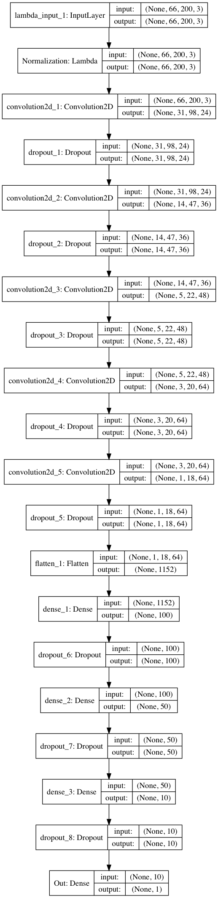

# Behavior Cloning
### Udacity Self-Driving Car Nanodegree - Project 3 

 
---
### Objective

The main objective of the project is to drive a car around a simulator.  While the car is driving it collect images.  A neural network then needs to be created and trained to take in the images and produce a proper steering angle to then drive the car around the track on it's own.

Steps of this project are the following:
* 1) Use the simulator to collect data of good driving behavior
* 2) Build, a convolution neural network in Keras that predicts steering angles from images
* 3) Train and validate the model with a training and validation set
* 4) Test that the model successfully drives around track one without leaving the road
* 5) Summarize the results with a written report

### Steps
---
##### 1) Use the simulator to collect DATA

This ended up being the biggest time commitment of the project for me.  I had to use the keyboard to drive the car because I do not have a mouse or joystick.  This made it very difficult to collect good data.  Many posts I read in the forums and on Medium all mentioned that the quality of the data was very important.  Indeed this is true.  After a few weeks of colelcting data and then training the model I tried using the Data set provided by Udacity alone and was able to get a model that passed driving on the track.  I would still like to collect my own data as I feel it is very important to do so, however  in a time crunch this can really set you back.

##### 2) Build, a convolution neural network in Keras that predicts steering angles from images

The starting point for me on this was the model that I had built and used for the previous project.  This did not provide good results and so I next set out to build a model similar to what was being mentioned in the forums and in posts as a good model for this project, the NVIDIA model referenced in [this paper](http://images.nvidia.com/content/tegra/automotive/images/2016/solutions/pdf/end-to-end-dl-using-px.pdf).  Once this model was set up and the parameters were properly set I was able to produce a model with weights that got the car around the track.

The end result looked like this.

* 2a) Model Breakdown
    * Input layer - The images needed to be cropped to 66 x 200 (original where 160 X 320) to fit into the original NVIDIA model input. 
    * Convolutional Layer with dropout - input (66,200,3), output (31,98,24)
    * Convolutional Layer with dropout - input(31,98,24), output(14,47,36)
    * Convolutional Layer with dropout - input(14,47,36), output(5,22,48)
    * Convolutional Layer with dropout - input(5,22,48), output(3,20,64)
    * Convolutional Layer with dropout - input(3,20,64), output(1,18,64)
    * Flatten
    * Fully connected layer
    * Fully connected layer
    * Fully connected layer
    * Output

##### 3) Train and validate the model with a training and validation set

After spending time trying to collect my own data I moved on to utilize the Udacity provided data set exclusively for the training set.  The validation set was taken from driving around the Jungle track, track 2 from the Beta track simulator in which I used a drawing pad with pen to move the car around the track in lieu of a mouse or joystick and in plac eof the keyboard.

######
Augmentation

Data augmentation was a huge part of this project. 

* Cropping the images to fit the NVIDIA model I ended up using was just one part.  
* Jittering the images was also used, this idea was not only mentioned in the forums and in posts but was also part of the last project.
* Randomizing the brightness was also an idea that I came across.  I have to admit it seemed like an odd idea at first and was not something I would have thought of.  But after reading more it began to make a lot of sense. 

##### 4) Test that the model successfully drives around track one without leaving the road

You can watch the video below to successfully see it navigate around the first track [here](https://www.youtube.com/watch?v=CMf-lcnNG6o).  

##### 5) Summarize the results with a written report

All in all I think I started out making this project harder than it needed to be.  At one point I must have had a couple hundred thousand images.  All taken from driving the courses forward and backward and then doing some recovery driving forward and backward, on all the courses. The training time was emense for all the data and really set me bac in the long run. In the end what lead to success was doing just a few things: augmenting the data, building the model and finding the sweet spot for the parameters.  

##### 6) Further development

* I did have an issue with the car driving poorly when I was trying to record it.  It seemed running all those processes caused a lag and made the car manuever poorly and drive off the track.  This really is a sign I think that the parameters could still be much better.
* Right now the car is driving slow.  If it moves too fast it will lose control and go off the road.  That also will need to be worked on.
* It failed course 2 on the simulator after going through and extended shadowy area.  So further image augmentation is needed.
* It also failed course 2 on the beta simulator.  Image aumentation for angled driving is another development myP project needs.

##### 6) Acknowldegments

There were many papers and posts I read to help get me through this challenge.  Without these I would not have been able to produce the results I got in the end.

* 1 - [NVIDIA paper](http://images.nvidia.com/content/tegra/automotive/images/2016/solutions/pdf/end-to-end-dl-using-px.pdf)
* 2 - [Referenced Vivek Yadav post](https://chatbotslife.com/using-augmentation-to-mimic-human-driving-496b569760a9#.yh93soib0)

# TO-DO
---
* Mimic the model information you put in project 2, detail-wise
